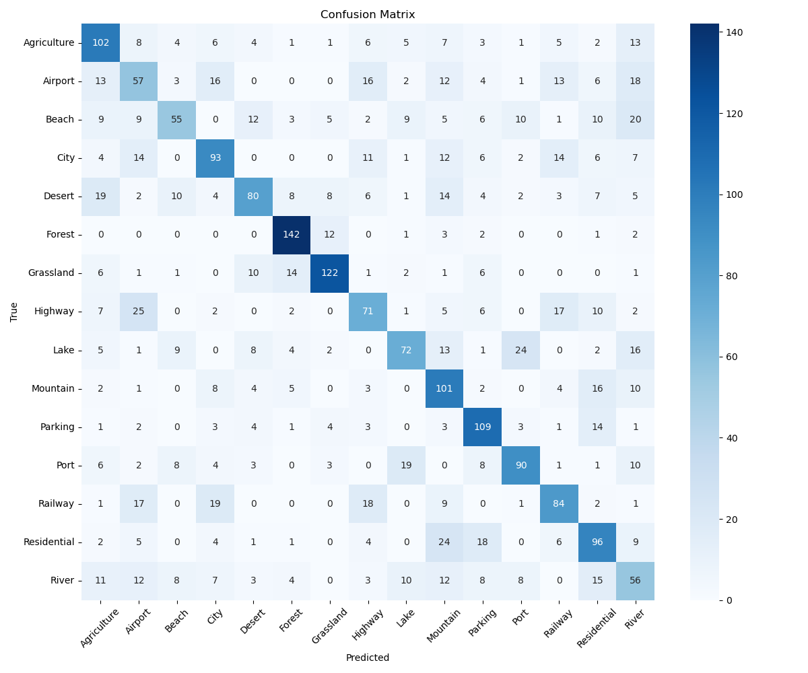
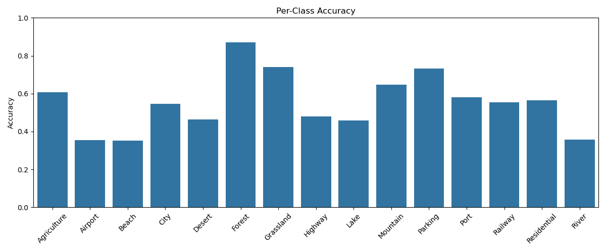
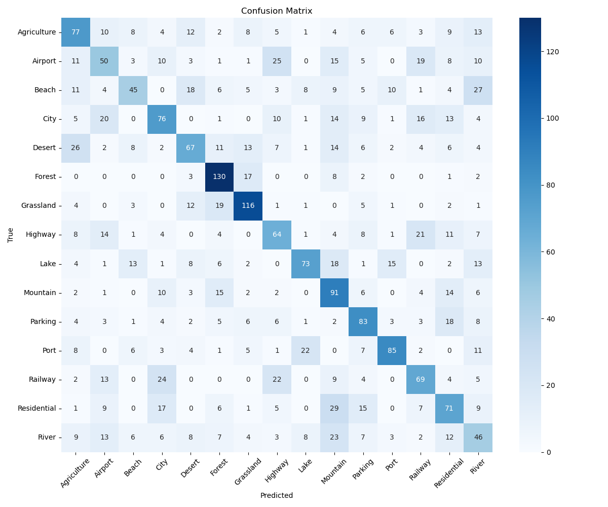
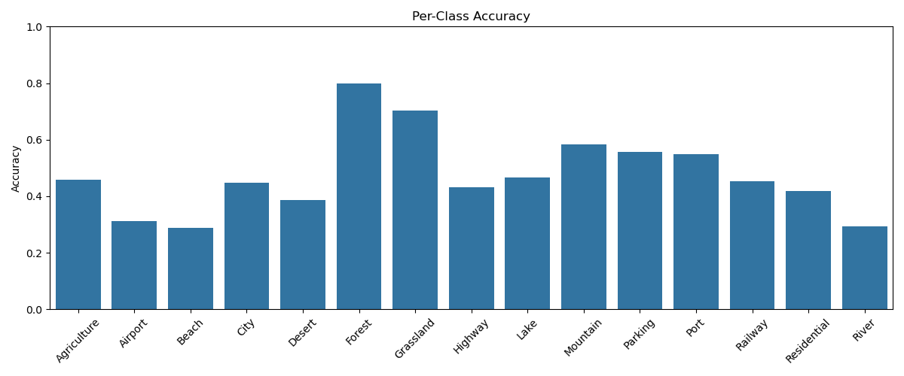
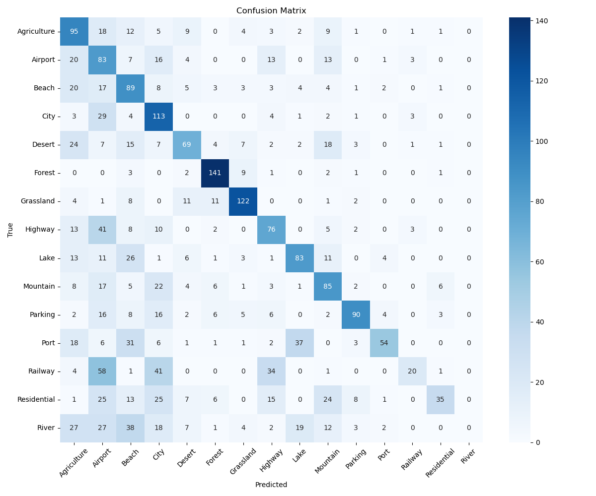
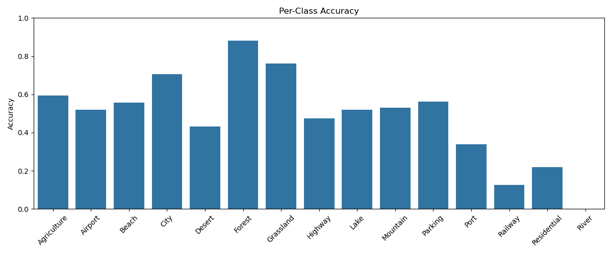

# 🛰️ LBP-SVM: Aerial Landscape Image Classification

This repository contains an implementation of aerial image classification using **Local Binary Pattern (LBP)** features and an **SVM classifier**.  
We explore three variants:

- ✅ `LBP-SVM_original.ipynb`: Baseline with full dataset
- 🧪 `LBP-SVM_augmented.ipynb`: With data augmentation
- ⚖️ `LBP-SVM_imbalanced.ipynb`: With artificially imbalanced dataset

---

## 📂 Dataset

- **Name:** `Aerial_Landscapes`
- **Classes (15):**  
  `Agriculture`, `Airport`, `Beach`, `City`, `Desert`, `Forest`, `Grassland`, `Highway`, `Lake`, `Mountain`, `Parking`, `Port`, `Railway`, `Residential`, `River`

- Each class originally has **800 grayscale images**
- Resized to **128x128 pixels**

---

## 🧠 Method Overview

| Component       | Details                           |
|----------------|------------------------------------|
| Feature Extractor | Local Binary Pattern (LBP)        |
| Classifier      | Support Vector Machine (SVM)      |
| LBP Params      | `radius=1`, `n_points=8`, `method='uniform'` |
| Evaluation      | Accuracy, Per-class performance, Confusion Matrix |

---

## 📊 Results & Visualizations

| Version     | Confusion Matrix                | Per-Class Accuracy Chart         |
|-------------|----------------------------------|----------------------------------|
| Original    |  |  |
| Augmented   |  |  |
| Imbalanced  |  |  |

---

## 🛠️ How to Run

### 🔧 Requirements

```bash
pip install numpy opencv-python scikit-learn matplotlib seaborn tqdm joblib
